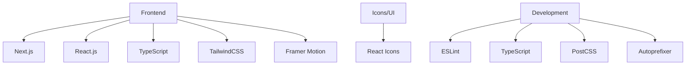

# 🤖 DevOps AI Agents Platform 🚀


> A comprehensive AI-powered platform designed to streamline DevOps workflows, automate routine tasks, and provide intelligent insights for your infrastructure and application development.

## 📋 Table of Contents

- [Features](#-features)
- [Technology Stack](#-technology-stack)
- [Getting Started](#-getting-started)
- [Architecture](#-architecture)
- [Components](#-components)
- [AI Integration](#-ai-integration)
- [Contributing](#-contributing)
- [License](#-license)

## ✨ Features

The platform offers a suite of AI-powered DevOps tools for modern software development and operations:

| Module | Description | Key Capabilities |
|--------|-------------|------------------|
| 🔄 **CI/CD Pipeline** | Automate your continuous integration and delivery pipelines | Workflow optimization, AI-driven analysis, GitHub integration |
| ☁️ **Cloud Infrastructure** | Manage and optimize your cloud resources | Multi-cloud support, cost optimization, incident response |
| 🧪 **Code Analysis** | Analyze your code for quality and security issues | Static analysis, performance insights, code metrics |
| 🔒 **Security Scanning** | Identify and remediate security vulnerabilities | Vulnerability detection, compliance checks, remediation |
| 🐳 **Container Orchestration** | Manage containerized applications and services | Deployment management, resource monitoring, scaling |
| 📊 **Performance Monitoring** | Monitor and optimize application performance | Real-time metrics, anomaly detection, historical trends |
| ⚡ **Load Testing** | Test system performance under various load conditions | Scenario templates, real-time analysis, resource utilization |
| 🚨 **Incident Response** | Detect and respond to system incidents automatically | Automated detection, response workflows, post-incident analysis |

## 🛠️ Technology Stack



- **Frontend Framework**: Next.js 14
- **UI Library**: React 18
- **Styling**: TailwindCSS with custom Microsoft-inspired theme
- **Animations**: Framer Motion
- **Icons**: React Icons
- **Type Safety**: TypeScript
- **Code Quality**: ESLint

## 🚀 Getting Started

### Prerequisites

- Node.js (v16.14 or later)
- npm or yarn

### Installation

```bash
# Clone the repository
git clone https://github.com/Yash-Kavaiya/Devops-AI-Agents.git
cd Devops-AI-Agents

# Install dependencies
npm install
# or
yarn install

# Start the development server
npm run dev
# or
yarn dev
```

### Build for Production

```bash
# Create a production build
npm run build
# or
yarn build

# Start the production server
npm run start
# or
yarn start
```

## 🏗️ Architecture

The application follows a modern frontend architecture using Next.js App Router:

```
devops-ai-agents/
├── app/                  # Next.js App Router
│   ├── ci-cd/            # CI/CD Pipeline module
│   ├── cloud-infrastructure/  # Cloud Infrastructure module
│   ├── code-analysis/    # Code Analysis module
│   ├── container-orchestration/  # Container Orchestration module
│   ├── incident-response/  # Incident Response module
│   ├── load-testing/     # Load Testing module
│   ├── performance-monitoring/  # Performance Monitoring module
│   ├── security-scanning/  # Security Scanning module
│   ├── layout.tsx        # Root layout
│   ├── page.tsx          # Home page
│   └── globals.css       # Global styles
├── components/           # Reusable React components
│   ├── AgentChat.tsx     # AI assistant chat interface
│   ├── FeatureCard.tsx   # Feature card component
│   ├── PageLayout.tsx    # Common page layout
│   └── Sidebar.tsx       # Navigation sidebar
├── public/               # Static assets
└── ...                   # Configuration files
```

## 🧩 Components

### Core Components

- **PageLayout**: Consistent layout for all feature pages
- **Sidebar**: Navigation for all platform modules
- **AgentChat**: Interactive AI assistant interface
- **FeatureCard**: Interactive cards for feature navigation

### AI Integration

Each module includes a specialized AI agent that provides:

- 🤖 Contextual assistance for the specific DevOps domain
- 📊 Intelligent analysis of your environment
- 💡 Automated suggestions and optimizations
- 🔍 Problem detection and resolution

## 🧠 AI Integration

The platform integrates AI capabilities throughout:

- **Specialized Agents**: Each module has a dedicated AI agent with domain-specific knowledge
- **Real-time Analysis**: AI models analyze your infrastructure and code to provide insights
- **Proactive Suggestions**: Get actionable recommendations to improve your DevOps processes
- **Conversational Interface**: Interact with AI agents through a natural chat interface

## 🤝 Contributing

Contributions are welcome! Please feel free to submit a Pull Request.

1. Fork the repository
2. Create your feature branch (`git checkout -b feature/amazing-feature`)
3. Commit your changes (`git commit -m 'Add some amazing feature'`)
4. Push to the branch (`git push origin feature/amazing-feature`)
5. Open a Pull Request

## 📄 License

This project is licensed under the MIT License - see the LICENSE file for details.

---

<div align="center">

**Built with ❤️ by [Yash Kavaiya](https://github.com/Yash-Kavaiya)**

</div>
