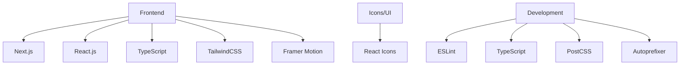
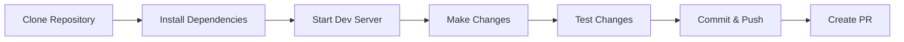
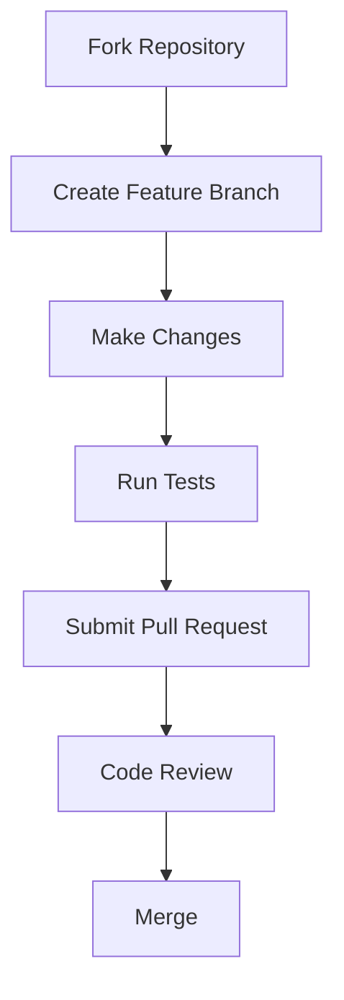

# 🤖 DevOps AI Agents Platform 🚀

<div align="center">
  
</div>

<div align="center">
  
  
  
  
  
  
  
  [](https://opensource.org/licenses/MIT)
  [](http://makeapullrequest.com)
  [](https://github.com/Yash-Kavaiya/Devops-AI-Agents/graphs/commit-activity)
  
</div>

<p align="center">
  <b>A comprehensive AI-powered platform designed to streamline DevOps workflows, automate routine tasks, and provide intelligent insights for your infrastructure and application development.</b>
</p>

---

## 📋 Table of Contents

- [✨ Features](#-features)
- [🎯 Quick Start](#-quick-start)
- [🛠️ Technology Stack](#️-technology-stack)
- [🚀 Getting Started](#-getting-started)
  - [Prerequisites](#prerequisites)
  - [Installation & Setup](#installation--setup)
  - [Build for Production](#build-for-production)
- [🏗️ Architecture](#️-architecture)
- [🧩 Components](#-components)
- [🧠 AI Integration](#-ai-integration)
- [📸 Screenshots](#-screenshots)
- [❓ FAQ](#-faq)
- [🐛 Troubleshooting](#-troubleshooting)
- [🗺️ Roadmap](#️-roadmap)
- [🤝 Contributing](#-contributing)
- [💬 Support](#-support)
- [📄 License](#-license)

---

## 🎯 Quick Start

Get started with DevOps AI Agents in just 3 steps:

```bash
# 1. Clone and navigate to the project
git clone https://github.com/Yash-Kavaiya/Devops-AI-Agents.git && cd Devops-AI-Agents/devops-ai-agents

# 2. Install dependencies
npm install

# 3. Start the development server
npm run dev
```

🎉 Open [http://localhost:3000](http://localhost:3000) in your browser to see the platform in action!

---

## ✨ Features

<p align="center">
  
</p>

### Why Choose DevOps AI Agents Platform?

🤖 **AI-Powered Automation** - Leverage artificial intelligence to automate repetitive tasks and optimize workflows

⚡ **Real-Time Insights** - Get instant feedback and actionable recommendations from specialized AI agents

🔒 **Security First** - Built-in security scanning and compliance checks to protect your infrastructure

📊 **Comprehensive Monitoring** - Monitor performance, track incidents, and analyze trends in real-time

🚀 **Easy Integration** - Designed to integrate seamlessly with your existing DevOps tools and workflows

💡 **Intelligent Recommendations** - AI-driven suggestions to improve code quality, performance, and security

### Platform Modules

The platform offers a suite of AI-powered DevOps tools for modern software development and operations:

| Module | Description | Key Capabilities | Preview |
|--------|-------------|------------------|---------|
| 🔄 **CI/CD Pipeline** | Automate your continuous integration and delivery pipelines | Workflow optimization, AI-driven analysis, GitHub integration |  |
| ☁️ **Cloud Infrastructure** | Manage and optimize your cloud resources | Multi-cloud support, cost optimization, incident response |  |
| 🧪 **Code Analysis** | Analyze your code for quality and security issues | Static analysis, performance insights, code metrics |  |
| 🔒 **Security Scanning** | Identify and remediate security vulnerabilities | Vulnerability detection, compliance checks, remediation | |
| 🐳 **Container Orchestration** | Manage containerized applications and services | Deployment management, resource monitoring, scaling |  |
| 📊 **Performance Monitoring** | Monitor and optimize application performance | Real-time metrics, anomaly detection, historical trends |  |
| ⚡ **Load Testing** | Test system performance under various load conditions | Scenario templates, real-time analysis, resource utilization |  |
| 🚨 **Incident Response** | Detect and respond to system incidents automatically | Automated detection, response workflows, post-incident analysis | |

---

## 🛠️ Technology Stack

<div align="center">



</div>

### Core Technologies:

| Category | Technologies |
|----------|--------------|
| **Frontend Framework** | Next.js 14 |
| **UI Library** | React 18 |
| **Styling** | TailwindCSS with custom Microsoft-inspired theme |
| **Animations** | Framer Motion |
| **Icons** | React Icons |
| **Type Safety** | TypeScript |
| **Code Quality** | ESLint |

---

## 🚀 Getting Started

### Prerequisites

- Node.js (v16.14 or later)
- npm or yarn

### Installation & Setup

#### Option 1: Standard Installation

<div align="center">

```bash
# Clone the repository
git clone https://github.com/Yash-Kavaiya/Devops-AI-Agents.git
cd Devops-AI-Agents/devops-ai-agents

# Install dependencies
npm install
# or
yarn install

# Start the development server
npm run dev
# or
yarn dev
```

</div>

The application will be available at `http://localhost:3000`

#### Option 2: Docker Installation

<div align="center">

```bash
# Clone the repository
git clone https://github.com/Yash-Kavaiya/Devops-AI-Agents.git
cd Devops-AI-Agents

# Build and run with Docker
docker build -t devops-ai-agents .
docker run -p 3000:3000 devops-ai-agents
```

</div>

#### Environment Variables (Optional)

Create a `.env.local` file in the `devops-ai-agents` directory for custom configurations:

```env
# Application
NEXT_PUBLIC_APP_URL=http://localhost:3000

# AI Integration (Optional - for future use)
OPENAI_API_KEY=your_openai_api_key
ANTHROPIC_API_KEY=your_anthropic_api_key

# Analytics (Optional)
NEXT_PUBLIC_GA_ID=your_google_analytics_id
```

### Development Workflow

<div align="center">



</div>

### Build for Production

<div align="center">

```bash
# Create a production build
npm run build
# or
yarn build

# Start the production server
npm run start
# or
yarn start
```

</div>

---

## 🏗️ Architecture

The application follows a modern frontend architecture using Next.js App Router:

<div align="center">

```
devops-ai-agents/
├── app/                  # Next.js App Router
│   ├── ci-cd/            # CI/CD Pipeline module
│   ├── cloud-infrastructure/  # Cloud Infrastructure module
│   ├── code-analysis/    # Code Analysis module
│   ├── container-orchestration/  # Container Orchestration module
│   ├── incident-response/  # Incident Response module
│   ├── load-testing/     # Load Testing module
│   ├── performance-monitoring/  # Performance Monitoring module
│   ├── security-scanning/  # Security Scanning module
│   ├── layout.tsx        # Root layout
│   ├── page.tsx          # Home page
│   └── globals.css       # Global styles
├── components/           # Reusable React components
│   ├── AgentChat.tsx     # AI assistant chat interface
│   ├── FeatureCard.tsx   # Feature card component
│   ├── PageLayout.tsx    # Common page layout
│   └── Sidebar.tsx       # Navigation sidebar
├── public/               # Static assets
└── ...                   # Configuration files
```

</div>

---

## 🧩 Components

### Core Components

<div align="center">
  
</div>

| Component | Description |
|-----------|-------------|
| **PageLayout** | Consistent layout for all feature pages |
| **Sidebar** | Navigation for all platform modules |
| **AgentChat** | Interactive AI assistant interface |
| **FeatureCard** | Interactive cards for feature navigation |

---

## 🧠 AI Integration

<div align="center">
  
</div>

The platform integrates AI capabilities throughout:

| AI Feature | Description |
|------------|-------------|
| **Specialized Agents** | Each module has a dedicated AI agent with domain-specific knowledge |
| **Real-time Analysis** | AI models analyze your infrastructure and code to provide insights |
| **Proactive Suggestions** | Get actionable recommendations to improve your DevOps processes |
| **Conversational Interface** | Interact with AI agents through a natural chat interface |

---

## 📸 Screenshots

<div align="center">

### 🏠 Home Dashboard


### 🔄 CI/CD Pipeline Management


### ☁️ Cloud Infrastructure


### 📊 Performance Monitoring


### 🐳 Container Orchestration


### ⚡ Load Testing


</div>

---

## ❓ FAQ

<details>
<summary><b>What is DevOps AI Agents Platform?</b></summary>
<br>
DevOps AI Agents Platform is a comprehensive AI-powered solution designed to streamline and automate various DevOps workflows. It provides specialized AI agents for different aspects of DevOps, including CI/CD, cloud infrastructure management, security scanning, and more.
</details>

<details>
<summary><b>Do I need API keys for AI features?</b></summary>
<br>
Currently, the platform includes simulated AI responses for demonstration purposes. To integrate with real AI services, you would need to configure API keys for services like OpenAI, Anthropic, or other AI providers in your environment variables.
</details>

<details>
<summary><b>Can I use this in production?</b></summary>
<br>
This platform is primarily designed as a showcase and starting point for DevOps AI integrations. While the frontend is production-ready, you'll need to implement actual backend services and integrate with real DevOps tools for production use.
</details>

<details>
<summary><b>Which cloud providers are supported?</b></summary>
<br>
The platform is designed to be cloud-agnostic. The UI supports managing resources across AWS, Azure, Google Cloud, and other major cloud providers. Backend integrations would need to be implemented based on your specific requirements.
</details>

<details>
<summary><b>Is this open source?</b></summary>
<br>
Yes! This project is open source and licensed under the MIT License. Contributions are welcome!
</details>

<details>
<summary><b>How can I customize the AI agents?</b></summary>
<br>
Each module has its own dedicated page component where you can customize the AI agent's behavior, prompts, and responses. Check the `devops-ai-agents/app/` directory for module-specific implementations.
</details>

---

## 🐛 Troubleshooting

### Common Issues and Solutions

#### Port Already in Use
```bash
# If port 3000 is already in use, you can specify a different port:
PORT=3001 npm run dev
```

#### Module Not Found Errors
```bash
# Clear node_modules and reinstall dependencies:
rm -rf node_modules package-lock.json
npm install
```

#### Build Errors
```bash
# Clear Next.js cache and rebuild:
rm -rf .next
npm run build
```

#### TypeScript Errors
```bash
# Regenerate TypeScript declarations:
npm run dev
# Next.js will automatically regenerate type definitions
```

#### Styling Issues
```bash
# Ensure TailwindCSS is properly configured:
npm install -D tailwindcss postcss autoprefixer
npx tailwindcss init -p
```

### Still Having Issues?

If you're still experiencing problems:
1. Check the [Issues](https://github.com/Yash-Kavaiya/Devops-AI-Agents/issues) page for similar problems
2. Make sure you're using Node.js v16.14 or later
3. Try running with `npm run dev` instead of `yarn dev` (or vice versa)
4. Clear your browser cache and restart the development server
5. Create a new issue with detailed information about your problem

---

## 🗺️ Roadmap

### ✅ Completed Features
- [x] Modern, responsive UI with TailwindCSS
- [x] 8 specialized DevOps AI agent modules
- [x] Interactive chat interface for each module
- [x] Real-time performance monitoring visualizations
- [x] Comprehensive documentation

### 🚧 In Progress
- [ ] Backend API integration
- [ ] User authentication and authorization
- [ ] Persistent data storage
- [ ] Real AI model integration (OpenAI, Claude, etc.)

### 🔮 Future Enhancements
- [ ] Multi-user support with team collaboration
- [ ] Integration with popular DevOps tools (Jenkins, GitHub Actions, GitLab CI)
- [ ] Custom workflow builder
- [ ] Advanced analytics and reporting dashboard
- [ ] Mobile application (iOS & Android)
- [ ] Webhook support for event-driven automation
- [ ] Plugin system for extensibility
- [ ] Dark mode theme
- [ ] Export/Import configuration
- [ ] Kubernetes native deployment options
- [ ] Advanced security features (RBAC, audit logs)
- [ ] Integration with monitoring tools (Prometheus, Grafana, Datadog)
- [ ] Multi-language support (i18n)

### 💡 Proposed Features
Want to see a feature? [Open a feature request](https://github.com/Yash-Kavaiya/Devops-AI-Agents/issues/new) and let us know!

---

## 🤝 Contributing

Contributions are welcome! Please feel free to submit a Pull Request.

<div align="center">



</div>

### Contribution Steps

1. Fork the repository
2. Create your feature branch (`git checkout -b feature/amazing-feature`)
3. Commit your changes (`git commit -m 'Add some amazing feature'`)
4. Push to the branch (`git push origin feature/amazing-feature`)
5. Open a Pull Request

### Code Standards

- Follow the established coding style
- Write tests for new features
- Keep documentation up-to-date
- Ensure your code passes ESLint checks

---

## 💬 Support

### Getting Help

- 📖 **Documentation**: Check this README and inline code comments
- 💬 **Discussions**: Join our [GitHub Discussions](https://github.com/Yash-Kavaiya/Devops-AI-Agents/discussions)
- 🐛 **Bug Reports**: [Open an issue](https://github.com/Yash-Kavaiya/Devops-AI-Agents/issues/new)
- 💡 **Feature Requests**: [Request a feature](https://github.com/Yash-Kavaiya/Devops-AI-Agents/issues/new)
- 📧 **Email**: For private inquiries, reach out to [Yash Kavaiya](https://github.com/Yash-Kavaiya)

### Connect With Us

<div align="center">

[](https://github.com/Yash-Kavaiya)
[](https://www.linkedin.com/in/yash-kavaiya/)

</div>

### Show Your Support

If you find this project helpful, please consider:
- ⭐ Starring the repository
- 🐛 Reporting bugs
- 💡 Suggesting new features
- 🤝 Contributing code
- 📢 Sharing with others

---

## 📄 License

This project is licensed under the MIT License - see the LICENSE file for details.

---

<div align="center">

<p>
  
  
</p>

### ⭐ Star History

If you find this project useful, please consider giving it a star! ⭐

[](https://star-history.com/#Yash-Kavaiya/Devops-AI-Agents&Date)

---

### 🙏 Acknowledgments

Special thanks to:
- All contributors who have helped improve this project
- The open-source community for amazing tools and libraries
- Everyone who has starred, forked, or shared this project

---

**Built with ❤️ by [Yash Kavaiya](https://github.com/Yash-Kavaiya)**

<p>
  <sub>Made with passion for the DevOps community</sub>
</p>

</div>
